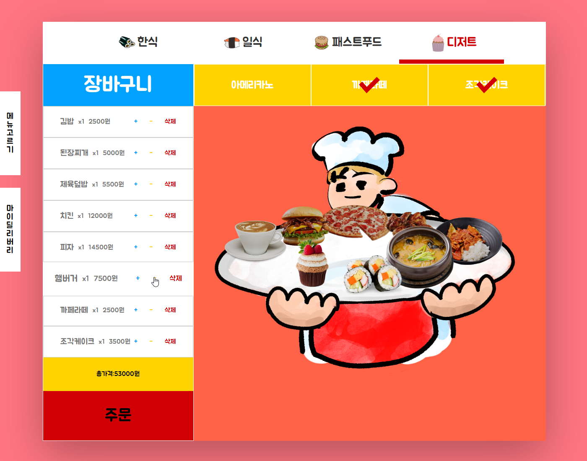
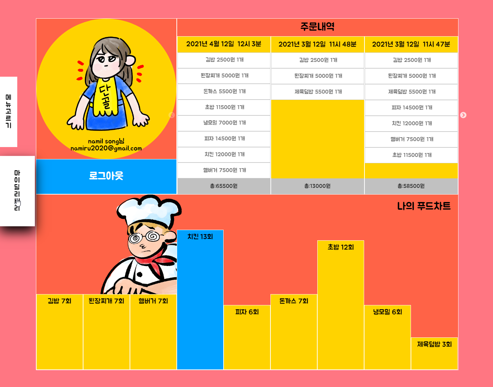
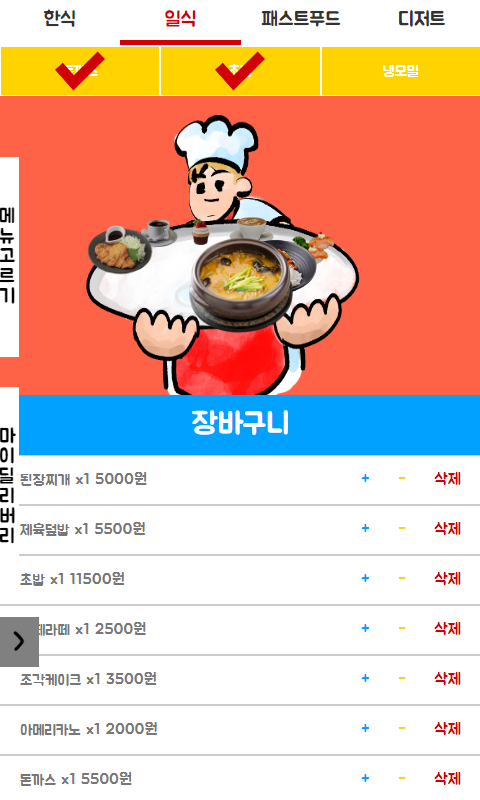
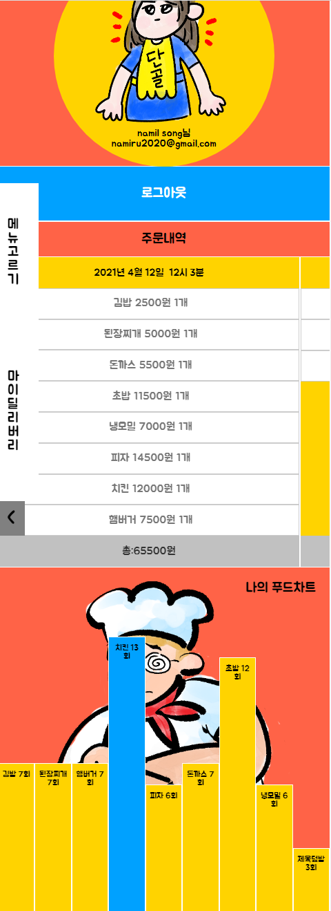

# Project - 'delivery'

## 메뉴를 실시간으로 보며 선택, 주문내역도 확인 가능한 반응형 웹.

### [딜리버리 웹페이지](https://delivery-project-950e0.firebaseapp.com/)

#### 개요

React의 Next.js 프레임워크를 사용하여 비교적 최신기술을 활용한 프로젝트를 제작하고자 했으며, Redux를 통해 모든 state를 저장,유지하며 사용하는 기능을 활용했습니다. 또한 파이어베이스를 활용해 로그인, 데이터베이스를 구현했으며 배포까지 진행했습니다.

```
주요 기능
1. 회원(구글),비회원 로그인
2. 시뮬레이션 => 선택한 메뉴의 이미지를 페이지에 랜더하여 실시간 시뮬레이션.
3. 선택한 음식을 삭제,수량의 조절.
4. 주문을 통해 선택한 메뉴의 내역을 DB에 저장.
5. 과거 주문내역 리스트 확인가능.
6. 지금까지 어떤 음식을 몇회 주문하였는지 통계차트 제공.
7. 모바일, 데스크탑 화면 사이즈별 반응형 웹.
```

#### 활용 기술

- React
- Next.js
- redux
- redux-saga
- react-slick
- styled-components
- webpack
- Firebase
- [github flow](https://guides.github.com/introduction/flow/)

--------------------------------------------

#### 구현 페이지(데스크탑 사이즈)  




#### 구현 페이지(모바일 사이즈)




